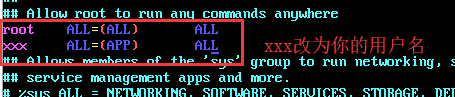

# 实际使用中所遇到的问题

## xxx 不在 sudoers 文件中（xxx is not in the sudoers file. ）

原因是你的用户名没有权限使用sudo,我们只要修改一下/etc/sudoers文件就行了。下面是修改方法:  

切换为管理员用户

``` shell
su root # (su - 也可以)
```

添加文件的写权限

```shell
chmod u+w /etc/sudoers
```

编辑/etc/sudoers文件

```shell
vi /etc/sudoers
```

找到"root ALL=(ALL) ALL"这一行，在下面添加"xxx ALL=(ALL) ALL"(这里的xxx是你的用户名)，如图：



然后保存（就是先按一 下Esc键，然后输入":wq"）退出

撤销文件的写权限。也就是输入命令""

```shell
chmod u-w /etc/sudoers
```

## 配置 DNS

通过修改 ``/etc/resolv.conf`` 文件来配置。  

修改NetworkManager.conf 配置文件

```shell
vim /etc/NetworkManager/NetworkManager.conf
```

在[main]中添加

```conf
dns=no
```

修改resolv.conf配置文件

vim /etc/resolv.conf
添加

```conf
#主DNS服务器
nameserver 218.85.157.99
#备DNS服务器
nameserver 114.114.114.114
```

重启NetworkManager

```shell
systemctl restart NetworkManager
```
