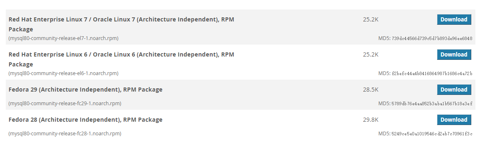
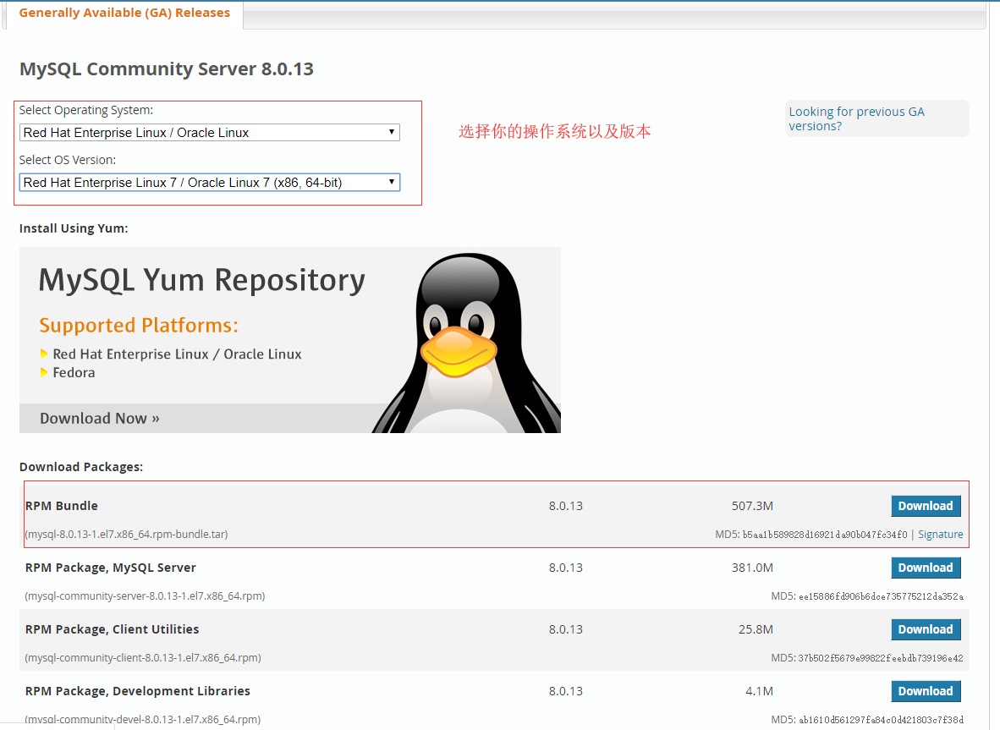
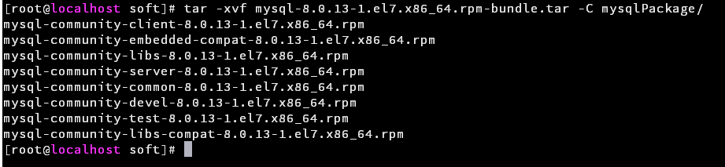

# 常用开发软件安装

## MySql 安装

### 通过 yum 在线安装

本次示例安装的为MySQL8.0  
这种安装方式需要系统可以连接外网

安装 MySQL yum 仓库源，可在[https://dev.mysql.com/downloads/repo/yum/](https://dev.mysql.com/downloads/repo/yum/)查看下载列表  



```shell
# 获取仓库
wget https://dev.mysql.com/get/mysql80-community-release-el7-1.noarch.rpm
# 安装
yum -y install mysql80-community-release-el7-1.noarch.rpm
# 安装 MySQL server
yum -y install mysql-server
```

由于网速原因，安装可能会很慢，耐心等待。  
安装完成过后通过 ``service mysqld start`` 启动服务  
MySQL会自动进行一些初始化操作，包括初始密码，可通过如下指令来查看初始密码：

```shell
grep password /var/log/mysqld.log
```

然后``mysql -uroot -p``输入密码登录MySQL

```sql
-- 修改密码
alter  user   root@"localhost"  identified by "新密码（尽量复杂）";
```

至此安装完成。

### 通过 yum 离线安装

由于在线安装可能受网络影响较大，可以通过离线方式安装

官方教程链接：[离线安装MySQL](https://dev.mysql.com/doc/refman/8.0/en/linux-installation-rpm.html)

去官网[地址](https://dev.mysql.com/downloads/mysql/)下载安装包



通过ftp或是其他方式传输到你的Linux系统上，创建一个目录存放解压后的文件,然后将文件解压到该目录

```shell
mkdir mysqlPackage
tar -xvf mysql-8.0.13-1.el7.x86_64.rpm-bundle.tar -C mysqlPackage/
```



进入解压目录，执行安装

```shell
cd mysqlPackage
yum install mysql-community-{server,client,common,libs}-* --exclude='*minimal*'
```

后续配置与在线安装相同